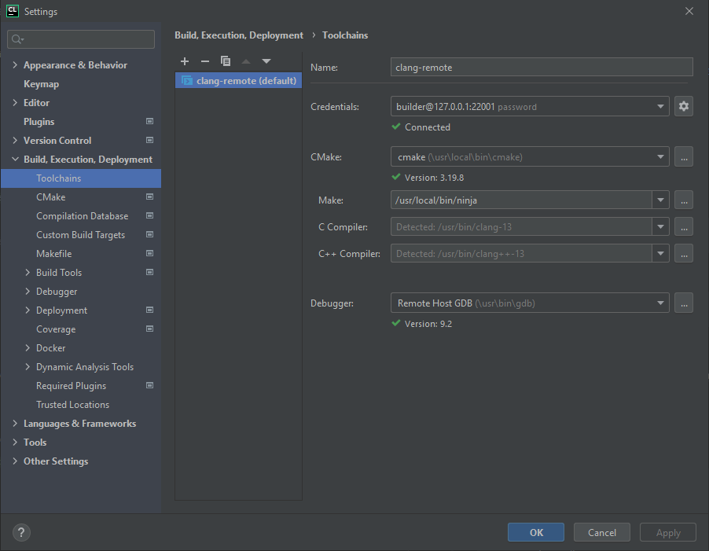
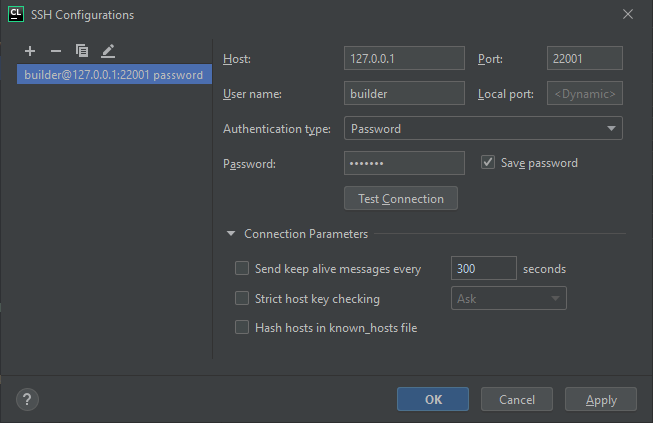
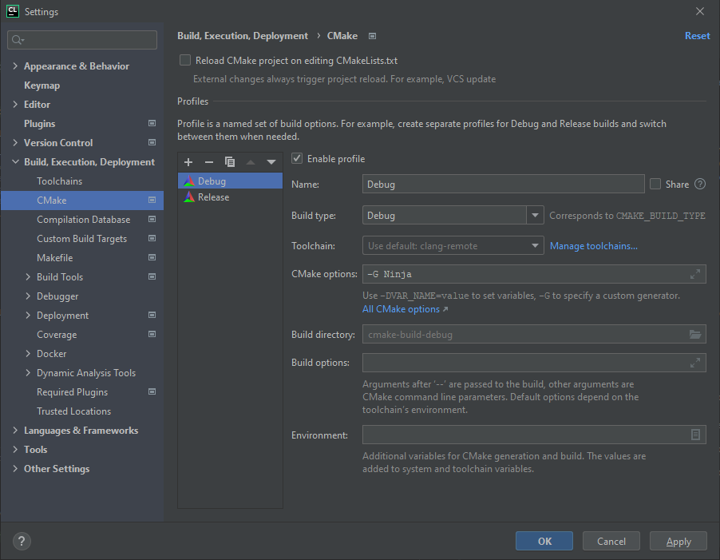

# Remote Development Environment for CLion

[![invasy/clang-remote @ GitHub][badge-github]][github]
[![invasy/clang-remote @ GitLab][badge-gitlab]][gitlab]
[![invasy/clang-remote @ Bitbucket][badge-bitbucket]][bitbucket]

[![Build Status][badge-travis]][travis]
[![Docker Automated Build Status][badge-build]][dockerhub]
[![Docker Image Size (latest by date)][badge-size]][dockerhub]
[![Docker Pulls][badge-pulls]][dockerhub]

## Toolchain
- [clang][]/[llvm][] 13
- [CMake][] 3.20.5
- [ninja][] 1.10.2
- [GNU Make][make] 4.2.1
- [GNU Debugger][gdb] (gdb) with gdbserver 9.2
- [rsync][] 3.1.3
- [OpenSSH][] server 8.2p1
- [Ubuntu 20.04 LTS (Focal Fossa)][Ubuntu]

_Note_: CMake versions 3.21.* are not supported by CLion versions up to 2021.2.*.

## Usage
1. Run service (container).
2. Set up CLion toolchain.
3. Build, run, debug your project in the container.

### Run container
```bash
docker run -d --cap-add=sys_admin --name=clang_remote -p 127.0.0.1:22001:22 invasy/clang-remote:latest
```
or from git repository:
```bash
docker-compose up -d
```

### CLion Configuration
#### Toolchains


- **Name**: `clang-remote`
- **Credentials**: _see **SSH Configurations** below_
- **CMake**: `/usr/local/bin/cmake`
- **Make**: `/usr/local/bin/ninja` (_see also **CMake** below_)
- **C Compiler**: `/usr/bin/clang-13` (_should be detected_)
- **C++ Compiler**: `/usr/bin/clang++-13` (_should be detected_)
- **Debugger**: `/usr/bin/gdb` (_should be detected_)

#### SSH Configurations


- **Host**: `127.0.0.1`
- **Port**: `22001`
- **Authentication type**: `Password`
- **User name**: `builder`
- **Password**: `builder`

#### CMake


- **Profiles**:
  - **Debug** (_or any other profile_):
    - **CMake options**: `-G Ninja`

## SSH
### Configuration
```
# ~/.ssh/config
Host clang-remote
User builder
HostName 127.0.0.1
Port 22001
HostKeyAlias clang-remote
StrictHostKeyChecking no
NoHostAuthenticationForLocalhost yes
PreferredAuthentications password
PasswordAuthentication yes
PubkeyAuthentication no
```

Remove old host key from `~/.ssh/known_hosts` after image rebuilding (_note `HostKeyAlias` in config above_):
```bash
ssh-keygen -f "$HOME/.ssh/known_hosts" -R "clang-remote"
```

### Connection
```bash
ssh clang-remote
```
Password: `builder`

## See Also
- [Remote development | CLion](https://www.jetbrains.com/help/clion/remote-development.html "Remote development | CLion")
- [Using Docker with CLion — The CLion Blog](https://blog.jetbrains.com/clion/2020/01/using-docker-with-clion/ "Using Docker with CLion — The CLion Blog")

[github]: https://github.com/invasy/clang-remote "invasy/clang-remote @ GitHub"
[gitlab]: https://gitlab.com/invasy/clang-remote "invasy/clang-remote @ GitLab"
[bitbucket]: https://bitbucket.org/invasy/clang-remote "invasy/clang-remote @ Bitbucket"
[travis]: https://app.travis-ci.com/invasy/clang-remote "invasy/clang-remote @ Travis CI"
[dockerhub]: https://hub.docker.com/r/invasy/clang-remote "invasy/clang-remote @ DockerHub"
[badge-github]: https://img.shields.io/badge/GitHub-invasy%2Fclang--remote-informational?logo=github "invasy/clang-remote @ GitHub"
[badge-gitlab]: https://img.shields.io/badge/GitLab-invasy%2Fclang--remote-informational?logo=gitlab "invasy/clang-remote @ GitLab"
[badge-bitbucket]: https://img.shields.io/badge/Bitbucket-invasy%2Fclang--remote-informational?logo=bitbucket "invasy/clang-remote @ Bitbucket"
[badge-travis]: https://app.travis-ci.com/invasy/clang-remote.svg?branch=master "invasy/clang-remote @ Travis CI"
[badge-build]: https://img.shields.io/docker/cloud/build/invasy/clang-remote "Docker Automated Build Status"
[badge-size]: https://img.shields.io/docker/image-size/invasy/clang-remote?sort=date "Docker Image Size (latest by date)"
[badge-pulls]: https://img.shields.io/docker/pulls/invasy/clang-remote "Docker Pulls"
[clang]: https://clang.llvm.org/ "Clang: a C language family frontend for LLVM"
[llvm]: https://llvm.org/ "The LLVM Compiler Infrastructure"
[CMake]: https://cmake.org/ "CMake"
[ninja]: https://ninja-build.org/ "Ninja, a small build system with a focus on speed"
[make]: https://www.gnu.org/software/make/ "GNU Make"
[gdb]: https://www.gnu.org/software/gdb/ "GNU Debugger"
[rsync]: https://rsync.samba.org/ "rsync"
[OpenSSH]: https://www.openssh.com/ "OpenSSH"
[Ubuntu]: https://releases.ubuntu.com/20.04/ "Ubuntu 20.04 LTS (Focal Fossa)"
